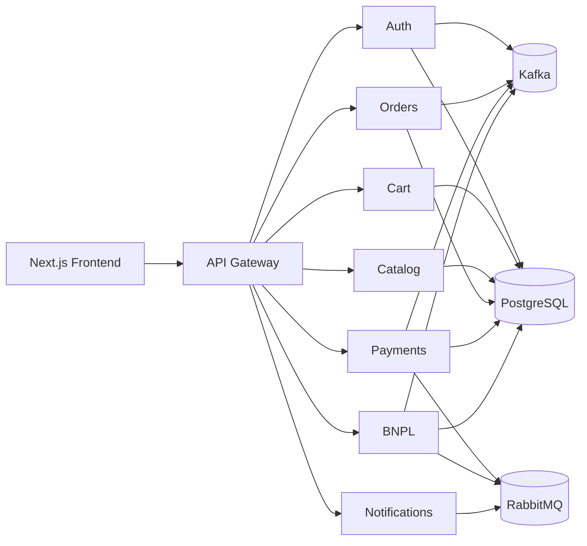
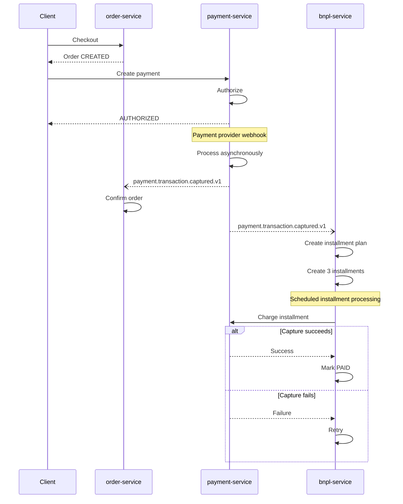

# BNPL System with Event-Driven Microservices

An ecommerce **Buy Now, Pay Later (BNPL)** platform built to explore event-driven microservices architecture and AI-assisted software engineering.

The project focuses on distributed-systems challenges such as asynchronous payment lifecycles, reliable event publishing, idempotent event processing, retries, eventual consistency, and installment-plan management.

It is intentionally scoped as an engineering project rather than a production-scale financial product, with the goal of making the architecture, trade-offs, and implementation patterns visible and testable.

**Stack:** NestJS · Next.js · Apache Kafka · RabbitMQ · PostgreSQL · TypeORM · React Query · Redis

---

## Architecture

The system consists of **8 NestJS microservices behind an API Gateway**, plus a standalone Next.js frontend.



The backend services are designed with clear boundaries and can be extracted into independent repositories if needed. Full breakdown (ports, databases, responsibilities) in [`docs/architecture.md`](docs/architecture.md).

---

## Key Engineering Decisions

### Event-driven architecture

Services communicate through a combination of synchronous HTTP and asynchronous messaging.

HTTP is used when an immediate response is required, while asynchronous events are used to decouple services and support longer-running workflows.

The architecture intentionally embraces **eventual consistency** between services.

### Kafka and RabbitMQ

The two messaging systems have different responsibilities.

**Kafka** is used for immutable domain events — facts about something that already happened.

Examples:

```text
payment.transaction.captured.v1
payment.transaction.refunded.v1
order.order.confirmed.v1
bnpl.installment.paid.v1
```

**RabbitMQ** is used for commands and operations that require retries and dead-letter handling.

Examples include payment webhook processing, notifications, and installment charging.

In short:

> **Kafka describes what happened. RabbitMQ asks something to be done.**

Full event catalog and RabbitMQ topology in [`docs/messaging.md`](docs/messaging.md).

### Transactional Outbox

The project uses the **Transactional Outbox pattern** to keep business changes and their corresponding events consistent.

Instead of updating the database and publishing to Kafka as two unrelated operations, the business change and the outbox record are committed in the same PostgreSQL transaction.

A separate publisher then delivers the event to Kafka.

This removes the critical gap where a database change could succeed while the corresponding event is never recorded for publication. Detail in [`docs/transactional-outbox.md`](docs/transactional-outbox.md).

### Idempotency

The system is designed around **at-least-once message delivery**.

Payment operations and event consumers therefore implement idempotency using mechanisms such as:

* Idempotency keys
* Database constraints
* Concurrency protection
* State validation
* Event identifiers

This prevents retries or duplicate deliveries from producing unintended business effects. Full breakdown, plus a real production-shutdown bug found and fixed this way, in [`docs/reliability-idempotency.md`](docs/reliability-idempotency.md).

### Payment state machine

Payments are modeled as explicit state transitions rather than independent flags.

The lifecycle includes authorization, capture, refunds, partial refunds, cancellation, voids, disputes, and chargebacks.

Webhook-driven transitions are validated so that duplicate or out-of-order processing cannot arbitrarily change the transaction state. Full state diagram in [`docs/payment-lifecycle.md`](docs/payment-lifecycle.md).

---

## Payment & BNPL Flow

The main flow is asynchronous after payment authorization:



The BNPL flow currently uses **three installments**.

After the payment capture is confirmed, the BNPL service creates the installment plan and manages the subsequent payment lifecycle, including retries and default handling. Full detail, including the hourly dunning job and the retry/default policy, in [`docs/installment-plans.md`](docs/installment-plans.md).

---

## AI-Assisted Development

This project was developed using **Orca and Claude Code** as AI-assisted engineering tools.

I retained ownership of the architectural decisions and technical direction, including:

* Service boundaries
* Communication patterns
* Event semantics
* Messaging responsibilities
* Testing strategy
* Project structure
* Payment and BNPL state management
* Reliability requirements

Claude Code was primarily used for implementation, tests, debugging, refactoring, and exploring solutions to specific engineering problems.

One example was the consistency problem between database transactions and Kafka events. Exploring possible solutions with Claude Code led to adopting the **Transactional Outbox** pattern.

The goal was to use AI as an implementation and problem-solving partner while keeping ownership of the architecture, trade-offs, and validation.

---

## Project Structure

The repository contains two independent applications:

```text
.
├── frontend/
│   └── Next.js application
│
├── backend/
│   ├── apps/
│   │   ├── api-gateway/
│   │   ├── auth-service/
│   │   ├── cart-service/
│   │   ├── catalog-service/
│   │   ├── order-service/
│   │   ├── payment-service/
│   │   ├── bnpl-service/
│   │   └── notification-service/
│   │
│   ├── packages/
│   │   ├── event-contracts/
│   │   ├── outbox/
│   │   ├── kafka-client/
│   │   ├── rabbitmq-client/
│   │   ├── observability/
│   │   └── config/
│   │
│   ├── e2e/
│   └── infra/
│       └── docker-compose.yml
│
└── docs/
    ├── architecture.md
    ├── messaging.md
    ├── transactional-outbox.md
    ├── reliability-idempotency.md
    ├── payment-lifecycle.md
    └── installment-plans.md
```

The backend uses a **pnpm workspace** to manage the microservices and shared packages.

---

## Testing

The project includes unit tests and cross-service E2E tests covering key workflows and failure scenarios.

External payment-provider interactions are mocked.

---

## Running Locally

### Requirements

* Node.js
* pnpm
* Docker
* Docker Compose

### Start infrastructure

```bash
cd backend
pnpm infra:up
```

### Install dependencies

```bash
pnpm install                  # in backend/
cd ../frontend && pnpm install
```

### Start a service

```bash
pnpm --filter <service-name> start:dev
```

### Start the frontend

```bash
cd frontend
pnpm dev
```

Open `http://localhost:3100`.

---

## Documentation

More detailed technical documentation is available in the [`docs/`](docs/) directory:

* [**Architecture**](docs/architecture.md) — service boundaries, communication patterns, repository pattern
* [**Messaging**](docs/messaging.md) — Kafka event catalog and RabbitMQ topology
* [**Transactional Outbox**](docs/transactional-outbox.md) — implementation and trade-offs
* [**Reliability & Idempotency**](docs/reliability-idempotency.md) — concurrency, retries, duplicate processing, a real shutdown bug found and fixed
* [**Payment Lifecycle**](docs/payment-lifecycle.md) — payment state machine and webhook processing
* [**Installment Plans (BNPL)**](docs/installment-plans.md) — plan creation and the dunning/retry flow

[`backend/README.md`](backend/README.md) and [`frontend/README.md`](frontend/README.md) cover per-project commands and structure.

---

## Current Scope

This is an intentionally scoped engineering project.

It does not attempt to implement every concern of a real financial product, such as credit underwriting, fraud detection, regulatory compliance, or production payment-provider integrations.

The focus is on exploring the **architecture and engineering trade-offs behind distributed payment and BNPL systems**.

### Next steps

The next stage is to take the architecture beyond the local environment and explore:

* Terraform
* Cloud infrastructure
* Managed databases and messaging
* CI/CD
* Secrets management
* Production-style observability
