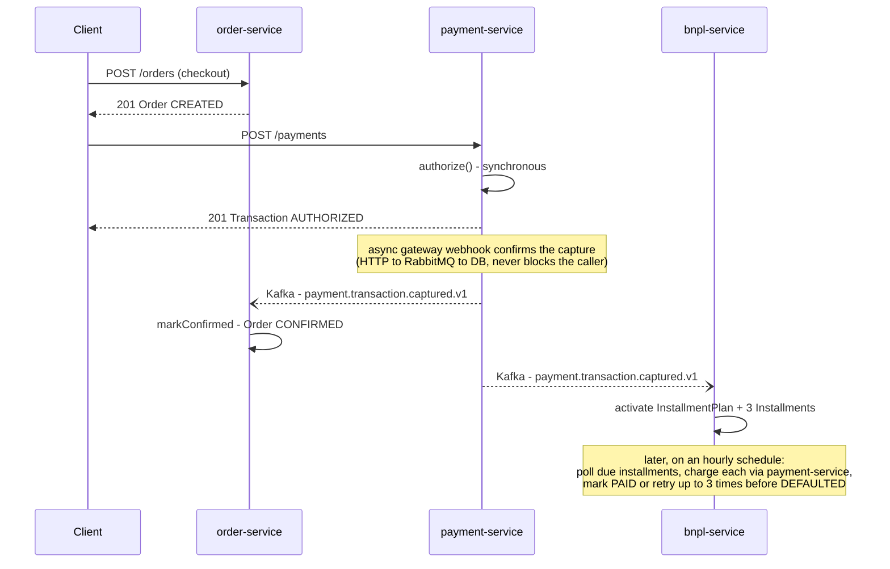

# BNPL System with Events

An ecommerce BNPL (buy now, pay later) platform built to exercise a full
event-driven microservices architecture end-to-end — not a toy CRUD app,
but the parts that are actually hard to get right: an async payment
lifecycle driven by real webhook confirmation, the transactional outbox
pattern, idempotent event consumers under at-least-once delivery, and a
working installment-plan/dunning flow. Nine independently deployable
services (a Next.js frontend + 8 NestJS microservices behind an API
gateway), coordinated over Kafka and RabbitMQ. It's deliberately a
learning/skeleton project — every pattern here is meant to be visible and
exercisable, not every business feature fully built out.

**Stack:** NestJS · Next.js · Apache Kafka · RabbitMQ · PostgreSQL ·
TypeORM · React Query

## Key engineering decisions

- **Event-driven communication, not just REST.** `frontend` only ever
  talks to `api-gateway`, which reverse-proxies synchronously for
  request/response needs — but everything reactive (payment lifecycle
  updates, notifications, installment charging) travels over Kafka or
  RabbitMQ instead. The one deliberate exception is `cart-service` calling
  `order-service` synchronously at checkout, because the client needs the
  new order id back immediately.
- **Kafka vs. RabbitMQ, chosen for their actual guarantees, not
  interchangeably.** Kafka topics (`payment.transaction.captured.v1`, etc.)
  are immutable domain-event facts — an audit trail other services react
  to. RabbitMQ queues are commands that need retry + a dead-letter queue
  (`bindRetryTopology()` in `@bnpl/rabbitmq-client`) — sending an email,
  processing a webhook, charging an installment. See
  [`backend/README.md`](backend/README.md#event-architecture).
- **Transactional outbox pattern** (`@bnpl/outbox`). The domain row and its
  outbox event are saved in the *same* Postgres transaction
  (`OrdersService.createOrder()` is the reference implementation); a
  decoupled poller publishes to Kafka after commit. The database and the
  event log can never diverge.
- **Idempotency wherever at-least-once delivery can bite.** Postgres
  advisory locks for first-write races where there's no row yet to lock
  (`PaymentsService.createPayment()`), pessimistic row locks plus a status
  guard for redelivery (`OrdersService.markConfirmed()`), a unique index as
  a DB-level backstop, and — for the one case where status alone can't
  distinguish a legitimate repeat from a redelivery — tracking the Kafka
  event's own id (`lastRefundEventId` on a second partial refund).
- **A correlation id and a separate business transaction id.**
  `correlationId` is per HTTP request; `transactionId` (born as `order.id`)
  survives across otherwise-unrelated requests, so a payment-gateway
  webhook — a brand-new HTTP request with no relation to the original
  checkout — still ties back to the same traced business flow.
  `payment-service` recovers it from its own database row, never from an
  inbound header.
- **The async payment lifecycle is an explicit, enforced state machine.**
  `Transaction.status` is validated on every transition by
  `assertTransition()` against `PAYMENT_TRANSITIONS`
  (`backend/packages/event-contracts/src/enums.ts`), so an out-of-order or
  redelivered webhook can never push the system into an invalid state.
- **Eventual consistency via choreography, not orchestration.** There's no
  central saga coordinator — each service reacts to events independently
  and idempotently, and correctness emerges from that rather than from a
  distributed transaction. That's the real trade-off of this style of
  architecture, and it's made explicit rather than papered over.

## Payment & BNPL flow

Checkout authorizes synchronously, but the actual capture is confirmed
asynchronously by a real webhook call — the same shape a production
payment gateway integration would take. Once captured, `bnpl-service`
spins up the installment plan and later collects each installment on its
own schedule.



Full detail — refunds, disputes/chargebacks, void, notifications, and the
complete dunning flow — is in
[`backend/README.md` § Key flows](backend/README.md#key-flows).

## AI-assisted development

This project was developed using Orca and Claude Code as AI-assisted
engineering tools.

The architectural decisions and technical direction remained under my
responsibility. I defined the service boundaries, communication patterns,
event semantics, project structure, testing strategy, and where to apply
use cases and Clean Code principles.

Claude Code was primarily used for implementation, writing tests,
debugging, refactoring, and exploring solutions to specific engineering
problems.

One example was the consistency problem between database transactions and
Kafka events. I wanted to make event publishing more reliable in case
something failed between persisting a change and publishing the
corresponding event. Claude Code helped explore possible approaches, which
led to adopting the Transactional Outbox pattern.

The goal was not to delegate architectural decisions to AI, but to use an
AI coding agent as an implementation and problem-solving partner while
keeping ownership of the design, trade-offs, and validation.

## Structure

```
frontend/            Standalone Next.js app (React Query + Zustand + Tailwind)
backend/             pnpm workspace
  apps/              8 NestJS microservices + api-gateway
  packages/          shared libs — event-contracts, outbox, kafka-client,
                      rabbitmq-client, observability, config
  e2e/               cross-service e2e suite (talks to the whole stack)
  infra/             docker-compose.yml — Postgres, Kafka, RabbitMQ, Redis, Adminer
```

`frontend/` and `backend/` are independent projects (each with its own
`package.json`/lockfile) — this repo works as the "guide" for running the
whole system together during development. Every folder under `backend/apps/`
is designed to be extractable into its own repo the day a team takes
ownership of that particular service.

See the [backend README](backend/README.md) (microservices, Kafka/RabbitMQ
event architecture, outbox pattern, key flows) and the
[frontend README](frontend/README.md) (stack, client architecture, pages)
for the detail on each project.

Each microservice has its own `CLAUDE.md` with the detail of its internal
architecture. `backend/packages/event-contracts/src/topics.ts` is the source
of truth for the Kafka event catalog and the RabbitMQ topology.

## Requirements

- Node.js 22+
- pnpm 12+
- Docker Desktop (Postgres, Kafka, RabbitMQ, Redis via docker-compose)

## Running everything in development

```bash
# 1. Infra (Postgres, Kafka, RabbitMQ, Redis)
cd backend
pnpm infra:up

# 2. Install dependencies
pnpm install                  # in backend/
cd ../frontend && pnpm install

# 3. Backend — each service in its own terminal
cd backend
pnpm --filter auth-service start:dev          # :3001
pnpm --filter catalog-service start:dev       # :3002
pnpm --filter cart-service start:dev          # :3003
pnpm --filter order-service start:dev         # :3004
pnpm --filter payment-service start:dev       # :3005
pnpm --filter bnpl-service start:dev          # :3006
pnpm --filter notification-service start:dev  # :3007
pnpm --filter api-gateway start:dev           # :3000

# 4. Seed the catalog (once, after catalog-service is connected to its DB)
pnpm --filter catalog-service run seed

# 5. Frontend
cd ../frontend
pnpm dev                                      # :3100
```

Open `http://localhost:3100`.

## Stopping the infra

```bash
cd backend
pnpm infra:down
```
