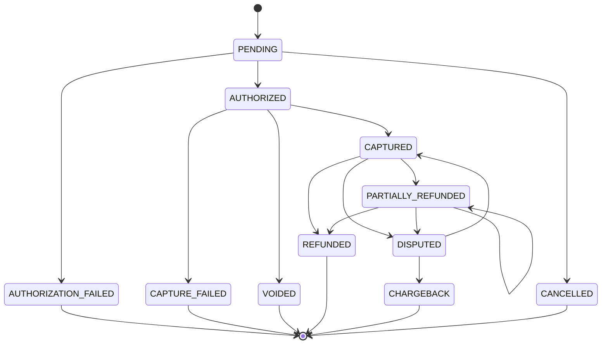
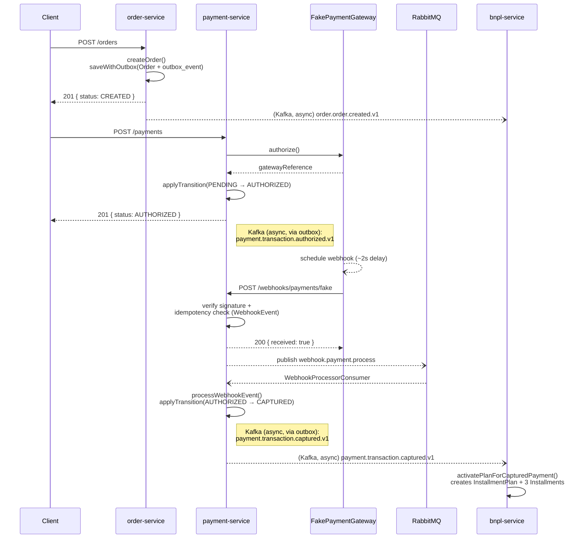
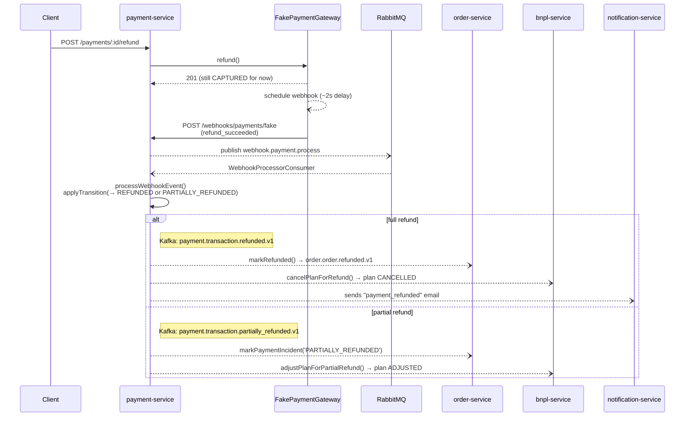

# Backend

Backend of the BNPL system: 8 independent NestJS microservices + an API
gateway, coordinated via events (Kafka) and commands (RabbitMQ), each with
its own PostgreSQL database. See the [root README](../README.md) for the
overall project context and the [frontend README](../frontend/README.md) for
the client.

## Technologies

- **NestJS** (one per microservice, `pnpm` workspace with `apps/*` + `packages/*`)
- **PostgreSQL 16** — one database per service (except `api-gateway`, which is stateless)
- **Apache Kafka 3.8.0** in **KRaft** mode (no Zookeeper) — immutable domain events
- **RabbitMQ 3** — point-to-point commands/tasks with retry + dead-letter queue
- **Redis** — reserved for infrastructure (cache/rate-limit), not yet in critical use
- **TypeORM** (`synchronize: true`, no migrations — this is a learning project, not production)
- **nestjs-pino** for structured logging, with correlation/transaction id auto-injected
- **Jest** (unit per service + e2e per service + cross-service e2e suite)
- **Docker Compose** for all local infra

## Microservices

| Service | Port | Database | Responsibility |
|---|---|---|---|
| `api-gateway` | 3000 | — | The frontend's single entry point. Verifies JWTs, adds/propagates `x-correlation-id`, reverse-proxies. No business logic. |
| `auth-service` | 3001 | `auth_db` | Identity: registration, login, JWT access/refresh, session revocation. |
| `catalog-service` | 3002 | `catalog_db` | Catalog: categories, products, variants. Read-only for the rest of the system. |
| `cart-service` | 3003 | `cart_db` | Shopping cart and checkout (synchronous call to `order-service`). |
| `order-service` | 3004 | `order_db` | Orders: creation, and reacting to payment-service's events (confirms, refunds, mirrors dispute/chargeback/partial-refund status). This is where the business `transactionId` is born. |
| `payment-service` | 3005 | `payment_db` | Payment state machine, gateway abstraction, async webhook pipeline. The most complex service. |
| `bnpl-service` | 3006 | `bnpl_db` | The "buy now, pay later" logic: credit scoring, installment plans, reacting to the payment lifecycle. |
| `notification-service` | 3007 | `notification_db` | Bridges domain events → email (Kafka → RabbitMQ → send). |

Every folder under `apps/` is designed to be extractable into its own repo —
there are no cross-imports between services; anything shared lives in
`packages/*`.

## Getting the environment up

```bash
pnpm install
pnpm infra:up                                   # Postgres, Kafka, RabbitMQ, Redis, Adminer
pnpm --filter <service> start:dev                # one terminal per service
pnpm --filter catalog-service run seed           # once, with catalog-service up
```

See the full command reference (tests, build, filters) in [`CLAUDE.md`](./CLAUDE.md).

## Event architecture

The system deliberately uses **two messaging mechanisms with different guarantees**:

- **Kafka = immutable facts.** A domain event (`order.created`, `payment.captured`, etc.) represents something that *already happened* — it's an audit log other services can react to, and from which the system's state could in principle be reconstructed. You never retry "the order" itself — the fact already occurred.
- **RabbitMQ = commands/tasks.** A "do this" instruction (send an email, process a webhook, charge an installment) that needs retries with backoff and a dead-letter queue if it ultimately fails — work-queue semantics, not log semantics.

### Outbox pattern (how we publish to Kafka without inconsistency)

Publishing directly to Kafka inside a database transaction isn't atomic (the DB and Kafka are two different systems) — if the DB commit fails after publishing, or the publish fails after the commit, the state ends up inconsistent. This is solved with the **outbox pattern** (`@bnpl/outbox`):

1. The service saves the domain entity *and* a row in `outbox_event` in the **same** Postgres transaction (`saveWithOutbox(queryRunner, entity, event)`).
2. `OutboxPublisherService` (a separate poller, decoupled from the HTTP request) reads unpublished rows and sends them to Kafka.

This guarantees that every event Kafka ends up seeing corresponds to a change that was actually persisted — never the other way around. The reference implementation is `OrdersService.createOrder()` in `apps/order-service`.

### Kafka event catalog (`packages/event-contracts/src/topics.ts`)

| Topic | Producer | Consumers |
|---|---|---|
| `order.order.created.v1` | order-service | notification-service |
| `order.order.confirmed.v1` | order-service | — (defined; consumed by nothing today, but no longer untriggered — see below) |
| `order.order.cancelled.v1` | order-service | — (defined, no flow triggers it yet) |
| `order.order.refunded.v1` | order-service | — |
| `payment.transaction.authorized.v1` / `.captured.v1` | payment-service | bnpl-service (captured → activates the installment plan), order-service (captured → confirms the order, emits `order.order.confirmed.v1`) |
| `payment.transaction.authorization_failed.v1` / `.capture_failed.v1` | payment-service | notification-service (email) |
| `payment.transaction.voided.v1` / `.cancelled.v1` | payment-service | — |
| `payment.transaction.partially_refunded.v1` | payment-service | bnpl-service (adjusts the plan), order-service (mirrors the signal onto the order's payment status) |
| `payment.transaction.refunded.v1` | payment-service | order-service (marks the order `REFUNDED`), bnpl-service (cancels the plan), notification-service (email) |
| `payment.transaction.dispute_opened.v1` | payment-service | order-service (mirrors the signal onto the order's payment status) |
| `payment.transaction.chargeback_received.v1` | payment-service | bnpl-service (puts the plan on hold + rescoring flag), order-service (mirrors the signal onto the order's payment status) |
| `bnpl.installment_plan.created.v1` / `.activated.v1` / `.adjusted.v1` / `.cancelled.v1` | bnpl-service | — |
| `bnpl.installment.due.v1` / `.paid.v1` / `.overdue.v1` / `.defaulted.v1` | bnpl-service (defined) | notification-service (`due.v1`) |
| `cart.cart.checked_out.v1` | — (deferred; see below) | — |
| `auth.user.registered.v1` | — (deferred) | — |

Naming: `<domain>.<entity>.<event>.v1`.

### RabbitMQ topology (`packages/event-contracts/src/topics.ts` → `RabbitMqTopology`)

`commands` exchange with dedicated routing keys/queues, each with retry + DLQ via `bindRetryTopology()` (`@bnpl/rabbitmq-client`): main queue → `retry.<queue>` (with TTL, dead-lettered back to the main queue) → `dlq.<queue>` once retries are exhausted.

| Queue | Publishes | Consumes | Purpose |
|---|---|---|---|
| `q.notifications.email.send` | notification-service (from the Kafka→RabbitMQ bridge) | notification-service | Decouples sending an email from translating the event. |
| `q.payments.webhook.process` | payment-service (`WebhooksController`) | payment-service (`WebhookProcessorConsumer`) | Don't block the HTTP response to the payment gateway while writing to the DB. |
| `q.payments.charge_installment` | — (defined, no publisher yet) | — | See "Known gaps" below. |
| `q.documents.generate_contract` | — (defined, no flow yet) | — | Reserved. |

### Correlation ID vs. Transaction ID

- **`correlationId`**: one per HTTP request. Generated/read by `CorrelationIdMiddleware` (`@bnpl/observability`) in each service, stored in an `AsyncLocalStorage` (`RequestContextService`), automatically injected into every log line (pino `mixin()`) and automatically propagated on outbound HTTP calls (`PropagatingHttpService`) and in Kafka/RabbitMQ message headers. Never passed manually through function parameters.
- **`transactionId`**: identifies a *business* flow (in practice, always `order.id`) and survives across otherwise-unrelated HTTP requests. `order-service` "creates" it (`requestContext.setTransactionId(order.id)`) right after `createOrder()`. A payment webhook arrives as a brand-new HTTP request (with its own new `correlationId`) — `payment-service` recovers the correct `transactionId` by looking up the `Transaction`/`orderId` row in its own database, **never trusting an inbound header** for this.

This lets you trace a complete business flow (checkout → payment → async webhook → refund) across logs from different services and different HTTP requests, using the same `transactionId`.

## Payment lifecycle

`Transaction.status` (`payment-service`) is the most involved state machine in
the system — every transition is validated by `assertTransition()` against
`PAYMENT_TRANSITIONS` (`packages/event-contracts/src/enums.ts`) and persisted
atomically with its outbox event by `PaymentsService`'s private
`applyTransition()`. `CANCELLED` is a defined-but-currently-unreachable edge
(no code path produces it yet) — shown for completeness.



## Key flows

### 1. Happy path: checkout → payment → async capture → installment plan

Steps 1–2 (order + sync authorization) happen inline in the HTTP request;
everything from the fake gateway's webhook onward happens asynchronously,
decoupled from any client request. Dashed arrows are async hops (outbox →
Kafka, or a command published to RabbitMQ) — solid arrows are synchronous
calls that block on a response.



The HTTP → RabbitMQ → DB indirection on the webhook exists so we don't block
the response to the payment gateway while writing to the database, and to
get retries for free if the write fails.

### 2. Refund (full or partial) — fan-out to three services

Triggered the same way as capture: `PaymentGatewayPort.refund()` schedules
another async webhook on the fake gateway. Which topic gets published, and
who reacts to it, depends on whether the refunded amount covers the full
transaction.



A **full** refund (`.refunded.v1`) moves the order to `REFUNDED` (and clears
any dispute/chargeback/partial-refund signal recorded on it). A **partial**
refund doesn't change `Order.status` — it only mirrors onto
`Order.paymentIncident` (`markPaymentIncident`), which the order's computed
`paymentStatus` reads first, so the client sees `PARTIALLY_REFUNDED` instead
of a stale `PAID`/`INSTALLMENTS_PENDING`. `bnpl-service` reacts to both, with
a different method for each.

### 3. Void, chargeback, and authorization failure (prose — single-service, no fan-out)

- **Void** (`POST /payments/:id/void`, requires `AUTHORIZED`): calls
  `PaymentGatewayPort.void()` synchronously (no webhook involved) →
  `applyTransition(VOIDED)` → outbox → `payment.transaction.voided.v1`. No
  consumer currently reacts to this topic.
- **Chargeback** (`POST /payments/:id/simulate-chargeback`, requires
  `CAPTURED`/`PARTIALLY_REFUNDED`): a real chargeback is initiated by the
  card network, not the merchant, so this endpoint deliberately **doesn't**
  call `PaymentGatewayPort` at all — it fires two direct, sequential
  transitions in the same request: `CAPTURED → DISPUTED`
  (`dispute_opened.v1`) → `DISPUTED → CHARGEBACK` (`chargeback_received.v1`).
  `bnpl-service` reacts by putting the plan on `DISPUTED_HOLD` and flagging
  the credit profile for rescoring — without publishing any new event of its
  own. `order-service` reacts to both topics by mirroring the signal onto
  `Order.paymentIncident` (`markPaymentIncident`), so the order's computed
  payment status reflects `DISPUTED`/`CHARGEBACK` instead of staying at
  whatever it was when the order was last confirmed.
- **Authorization failure**: if the synchronous `PaymentGatewayPort.authorize()`
  call in `createPayment()` throws, `applyTransition(AUTHORIZATION_FAILED)`
  still runs (outbox → `payment.transaction.authorization_failed.v1`) before
  the original error is re-thrown to the caller — so `POST /payments` itself
  returns an error even though the failed-state transition was durably
  persisted and published.

### 4. Notifications: Kafka → RabbitMQ → email (two hops, on purpose)

`notification-service` separates *translating* the domain event (Kafka → `email.send` command, no retry, pure and testable logic) from *delivering* it (a RabbitMQ consumer with retry/DLQ that calls `EmailProviderPort`). This keeps the event→email mapping decoupled from retry/delivery concerns.

## Repository pattern (swappable external providers)

Each external integration is an abstract class (contract) + a DI token + a fake implementation, selected by an environment variable in a factory provider — switching to a real provider never touches consumer code:

| Port | Service | Current implementation | Real future option |
|---|---|---|---|
| `PaymentGatewayPort` | payment-service | `FakePaymentGateway` | MercadoPago, PayPal |
| `EmailProviderPort` | notification-service | `ConsoleEmailProvider` (just logs) | SendGrid, SES |
| `TokenProviderPort` | auth-service | `JwtTokenProvider` | Auth0, Keycloak, Cognito |

## Known gaps (deliberately deferred, not bugs)

- **Installment charging ("dunning")**: `bnpl-service` creates `Installment`s with real due dates, but there's no job that charges them when due. The `q.payments.charge_installment` queue is defined but nothing publishes/consumes it yet. See `apps/bnpl-service/CLAUDE.md`.
- **`cart.cart.checked_out.v1`** and **`auth.user.registered.v1`**: topics defined in the catalog, no publisher yet.
- **notification-service uses `userId` as the "destination email"**: no consumed domain event carries a real email address, only `userId`. See `apps/notification-service/CLAUDE.md`.

## Testing

- Unit, per service: `pnpm --filter <service> test`.
- E2E, per service: `pnpm --filter <service> test:e2e` (each one spins up its own infra via Docker Compose; some, like `bnpl-service`, publish synthetic events directly to Kafka so they don't depend on other services being up).
- Cross-service E2E: `backend/e2e/` (`pnpm test:e2e` from `backend/`) — exercises the complete system (happy path and refund) against every real service running together.

More per-service architecture detail is in each one's own `CLAUDE.md` under `apps/`.
