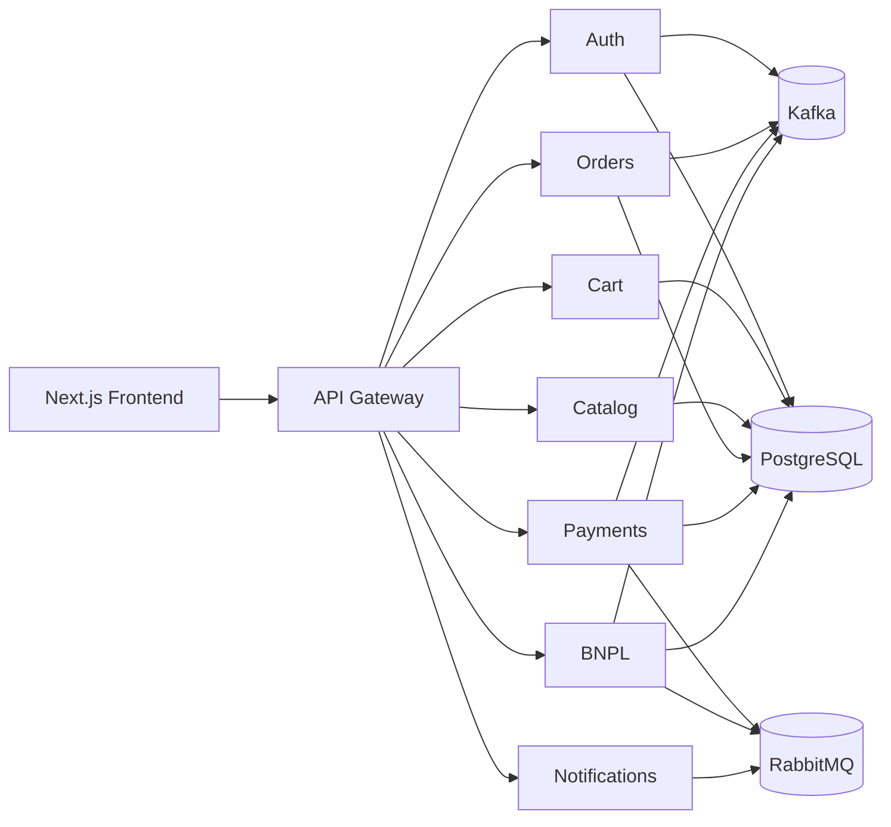

# Architecture

Nine independently deployable services — a Next.js frontend plus 8 NestJS
apps (7 business microservices + `api-gateway`) — coordinated over
synchronous HTTP, Kafka, and RabbitMQ. See
[`messaging.md`](messaging.md) for why two different async mechanisms
exist side by side.

Redis is provisioned in `docker-compose.yml` (reserved for cache/rate-limit)
but nothing consumes it yet — left off the diagram above since it isn't
part of any real flow today.

## Nine independent projects, one gateway

`frontend/` never talks to an individual microservice — it only calls
`api-gateway` (port 3000), which verifies JWTs at the edge, adds/propagates
`x-correlation-id`, and reverse-proxies to `auth-service`,
`catalog-service`, `cart-service`, `order-service`, `payment-service`,
`bnpl-service`, `notification-service`. No business logic lives in the
gateway itself.

**Payment-gateway webhooks are the one exception**: they hit
`payment-service` directly, bypassing the gateway, since they need a
stable public URL and no JWT (see [`payment-lifecycle.md`](payment-lifecycle.md)).

## Microservices

| Service | Port | Database | Responsibility |
|---|---|---|---|
| `api-gateway` | 3000 | — | The frontend's single entry point. Verifies JWTs, adds/propagates `x-correlation-id`, reverse-proxies. No business logic. |
| `auth-service` | 3001 | `auth_db` | Identity: registration, login, JWT access/refresh, session revocation. |
| `catalog-service` | 3002 | `catalog_db` | Catalog: categories, products, variants. Read-only for the rest of the system. |
| `cart-service` | 3003 | `cart_db` | Shopping cart and checkout (synchronous call to `order-service`). |
| `order-service` | 3004 | `order_db` | Orders: creation, and reacting to payment-service's events (confirms, cancels, refunds, mirrors dispute/chargeback/partial-refund status). This is where the business `transactionId` is born. |
| `payment-service` | 3005 | `payment_db` | Payment state machine, gateway abstraction, async webhook pipeline. The most complex service. |
| `bnpl-service` | 3006 | `bnpl_db` | The "buy now, pay later" logic: credit scoring, installment plans, dunning, reacting to the payment lifecycle. |
| `notification-service` | 3007 | `notification_db` | Bridges domain events → email (Kafka → RabbitMQ → send). |

Every folder under `backend/apps/` is designed to be extractable into its
own repo — there are no cross-imports between services; anything shared
lives in `backend/packages/*`.

## Repository pattern for external integrations

Each external integration is an abstract class (contract) + a DI token + a
fake implementation, selected by an environment variable in a factory
provider — switching to a real provider never touches consumer code:

| Port | Service | Current implementation | Real future option |
|---|---|---|---|
| `PaymentGatewayPort` | payment-service | `FakePaymentGateway` | MercadoPago, PayPal |
| `EmailProviderPort` | notification-service | `ConsoleEmailProvider` (just logs) | SendGrid, SES |
| `TokenProviderPort` | auth-service | `JwtTokenProvider` | Auth0, Keycloak, Cognito |
