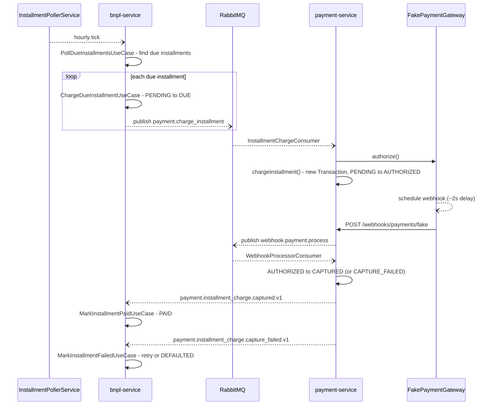

# Installment Plans (BNPL)

`bnpl-service` owns everything "buy now, pay later" — creating the
3-installment plan once a payment captures, and later collecting each
installment on its own schedule. It never talks to
`PaymentGatewayPort` directly for the original purchase; it only reacts
to `payment-service`'s events. See
[`payment-lifecycle.md`](payment-lifecycle.md) for the payment side this
reacts to.

## Plan creation, on capture

`payment.transaction.captured.v1` → `ActivateInstallmentPlanUseCase`:
creates the plan (`PENDING` → outbox `bnpl.installment_plan.created.v1` →
`ACTIVE` → outbox `bnpl.installment_plan.activated.v1`, both in the same
DB transaction) plus 3 `Installment` rows, skipping entirely if
`paymentMethod` was `FULL` or the user's `CreditProfile.blocked`.
Splitting `totalCents` into 3 uses `Math.floor(totalCents / 3)` for the
first two installments and puts the remainder on the third, so they
always sum exactly. Idempotent against Kafka redelivery via a Postgres
advisory lock plus a unique index on `InstallmentPlan.orderId` as a
DB-level backstop (see
[`reliability-idempotency.md`](reliability-idempotency.md)).

Refunds and disputes on the underlying payment adjust or hold the plan —
`CancelInstallmentPlanUseCase`, `AdjustInstallmentPlanUseCase`,
`HoldInstallmentPlanUseCase`/`ResumeInstallmentPlanUseCase` — covered in
[`payment-lifecycle.md`](payment-lifecycle.md)'s refund/chargeback/
dispute-resolution sections.

## Installment charging ("dunning"): poll → command → charge → react

The only *scheduled*, not reactive, flow in the system —
`bnpl-service`'s `InstallmentPollerService` runs
`PollDueInstallmentsUseCase` hourly, finding every `Installment` in
`PENDING`/`DUE` whose `dueDate` has already passed.

An installment charge is its own `Transaction` row in payment-service
(`installmentId` set, `orderId` shared with the order's original — by now
terminally `CAPTURED` — `Transaction`), going through the exact same
state machine and `PaymentGatewayPort` as the original purchase. It
publishes **new, distinct topics**
(`payment.installment_charge.captured.v1` /
`.installment_charge.capture_failed.v1`) rather than the generic
`payment.transaction.captured.v1` — specifically so bnpl-service's own
`PaymentEventsConsumer` (which reacts to the generic topic by
re-activating a plan) never gets confused about which "capture" just
happened.

`retryCount` / `InstallmentStatus.DEFAULTED` / `CreditProfile.blocked` —
all present in the schema from the start but unused until this flow — are
now exercised:

- **Success** → `MarkInstallmentPaidUseCase`: `PAID`, outbox
  `bnpl.installment.paid.v1`.
- **Failure, `retryCount < 3`** → back to `PENDING`, `dueDate += 3 days`,
  for the next hourly poll to pick up.
- **Failure, `retryCount >= 3`** → `DEFAULTED` + outbox
  `bnpl.installment.defaulted.v1` + `CreditProfile.blocked = true`. The
  user's *other* installments on the same plan are left untouched — a
  default blocks future plans, it doesn't cascade-cancel the current one.
