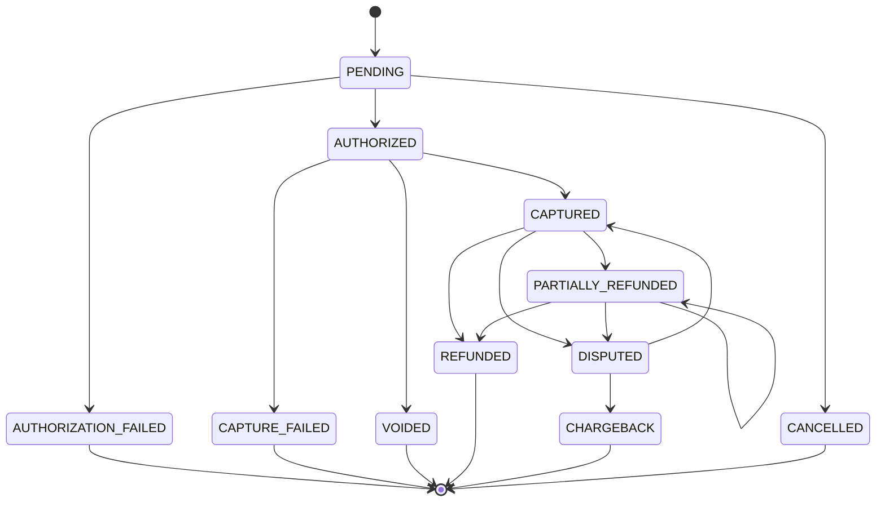
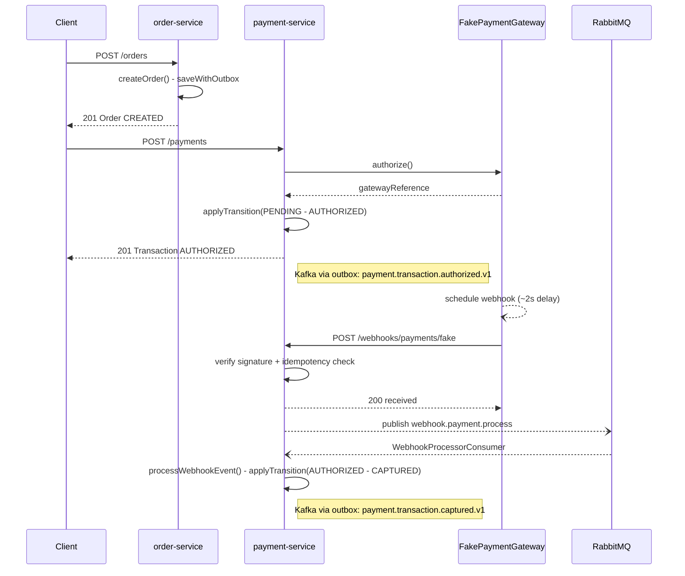
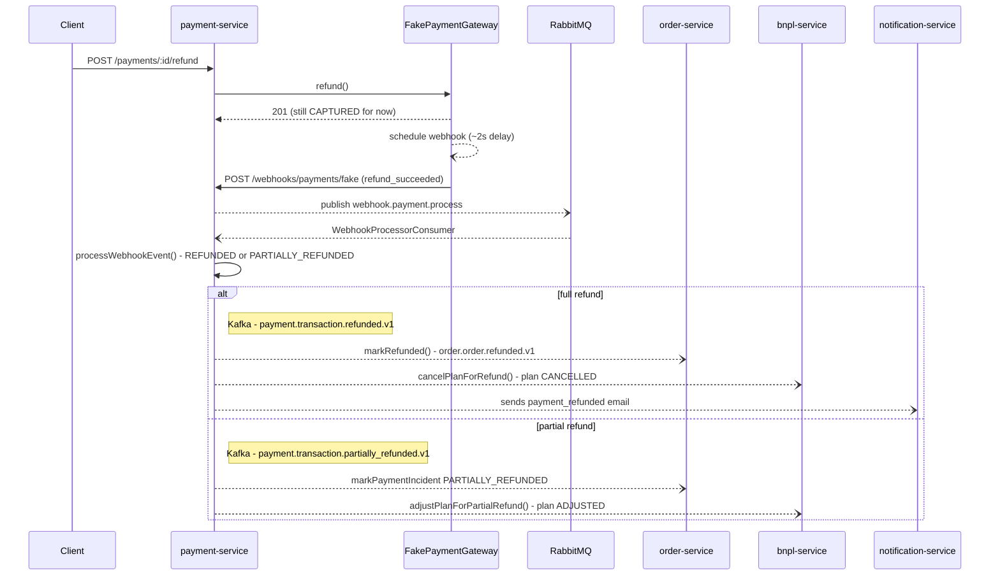

# Payment Lifecycle

`Transaction.status` (`payment-service`) is the most involved state
machine in the system — every transition is validated by
`assertTransition()` against `PAYMENT_TRANSITIONS`
(`backend/packages/event-contracts/src/enums.ts`) and persisted atomically
with its outbox event by `PaymentsService`'s private `applyTransition()`.
Webhook-driven transitions are validated the same way as synchronous ones,
so a duplicate or out-of-order webhook delivery can never push the
transaction into an invalid state.

`CANCELLED` is a defined-but-currently-unreachable edge (no code path
produces it yet) — shown for completeness.

## Happy path: checkout → sync authorize → async capture

Order creation and synchronous authorization happen inline in the HTTP
request; everything from the gateway's webhook onward happens
asynchronously, decoupled from any client request.

`order-service` reacts to `payment.transaction.captured.v1` by confirming
the order; `bnpl-service` reacts to the same event by creating the
installment plan — see [`installment-plans.md`](installment-plans.md).

The HTTP → RabbitMQ → DB indirection on the webhook exists so we don't
block the response to the payment gateway while writing to the database,
and to get retries for free if the write fails.

## Refund (full or partial) — fan-out to three services

Triggered the same way as capture: `PaymentGatewayPort.refund()`
schedules another async webhook. Which topic gets published, and who
reacts to it, depends on whether the refunded amount covers the full
transaction.

A **full** refund (`.refunded.v1`) moves the order to `REFUNDED` (and
clears any dispute/chargeback/partial-refund signal recorded on it). A
**partial** refund doesn't change `Order.status` — it only mirrors onto
`Order.paymentIncident` (`markPaymentIncident`), which the order's
computed `paymentStatus` reads first, so the client sees
`PARTIALLY_REFUNDED` instead of a stale `PAID`/`INSTALLMENTS_PENDING`.
`bnpl-service` reacts to both, with a different method for each — see
[`installment-plans.md`](installment-plans.md).

## Void, chargeback, dispute resolution, and authorization failure

Single-service transitions, no diagram needed:

- **Void** (`POST /payments/:id/void`, requires `AUTHORIZED`): calls
  `PaymentGatewayPort.void()` synchronously (no webhook involved) →
  `applyTransition(VOIDED)` → outbox → `payment.transaction.voided.v1`.
  `order-service` reacts by cancelling the order (`cancelOrder()`, only
  from `CREATED`).
- **Chargeback** (`POST /payments/:id/simulate-chargeback`, requires
  `CAPTURED`/`PARTIALLY_REFUNDED`): a real chargeback is initiated by the
  card network, not the merchant, so this endpoint deliberately **doesn't**
  call `PaymentGatewayPort` at all — it fires two direct, sequential
  transitions in the same request: `CAPTURED → DISPUTED`
  (`dispute_opened.v1`) → `DISPUTED → CHARGEBACK`
  (`chargeback_received.v1`). `bnpl-service` reacts by putting the plan on
  `DISPUTED_HOLD` and flagging the credit profile for rescoring.
  `order-service` reacts to both topics by mirroring the signal onto
  `Order.paymentIncident`.
- **Dispute resolved** (`POST /payments/:id/resolve-dispute`, requires
  `DISPUTED`): the mirror image of opening a dispute — the card network
  ruled in the merchant's favor, so this also bypasses
  `PaymentGatewayPort` and fires a single direct transition,
  `DISPUTED → CAPTURED` (`dispute_resolved.v1`). `bnpl-service` reacts by
  taking the plan off `DISPUTED_HOLD` back to `ACTIVE`; `order-service`
  clears `Order.paymentIncident` back to `null`, the same way a full
  refund does.
- **Authorization failure**: if the synchronous
  `PaymentGatewayPort.authorize()` call in `createPayment()` throws,
  `applyTransition(AUTHORIZATION_FAILED)` still runs (outbox →
  `payment.transaction.authorization_failed.v1`) before the original
  error is re-thrown — so `POST /payments` itself returns an error even
  though the failed-state transition was durably persisted and published.
  `order-service` reacts the same way it does to a void: `cancelOrder()`,
  so the order doesn't sit at `CREATED` forever with no payment behind
  it. Both reactions are idempotent no-ops for an order that already
  moved past `CREATED` some other way.

## Notifications: Kafka → RabbitMQ → email (two hops, on purpose)

`notification-service` separates *translating* the domain event (Kafka →
`email.send` command, no retry, pure and testable logic) from
*delivering* it (a RabbitMQ consumer with retry/DLQ that calls
`EmailProviderPort`). This keeps the event→email mapping decoupled from
retry/delivery concerns.
